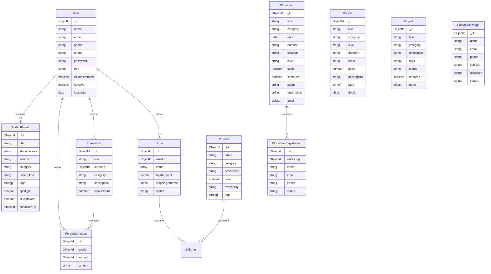

# STEMSAGE Backend API Specification & Architecture Design

> **Document Version:** 1.0.0  
> **Phase:** 3 — Backend API Architecture & Specification  
> **Status:** Architecture Approved / Ready for Phase 4 Implementation  

---

## 1. API Architecture Overview

The **STEMSAGE Backend API** is built as a RESTful web service using **Node.js, Express, and MongoDB (Mongoose)**.

### Key Architectural Principles
- **Decoupled Routing**: Frontend route navigation is managed exclusively by **React Router** (`/`, `/about`, `/courses`, `/workshops`, `/services`, `/projects`, `/student-projects`, `/store`, `/forum`, `/contact`, `/learning`). Express **does NOT** serve or intercept frontend page routes.
- **Dedicated Namespace**: All backend endpoints reside strictly under the `/api` namespace (e.g., `/api/auth/login`, `/api/courses`, `/api/workshops`).
- **Resource-Oriented Nouns**: Endpoints use plural nouns adhering to standard HTTP methods (`GET`, `POST`, `PUT`, `DELETE`, `PATCH`). Action-oriented route names (e.g., `/api/getCourses`, `/api/createCourse`) are explicitly avoided.
- **Stateless Authentication**: Authentication utilizes JSON Web Tokens (JWT) passed via the `Authorization: Bearer <token>` header.
- **Consistent Interface**: All requests and responses communicate via JSON payloads formatted with a unified JSON response contract.

---

## 2. Base URL & Environment Configuration

| Environment | Base URL |
| :--- | :--- |
| **Local Development** | `http://localhost:5000/api` |
| **Production** | `https://stemsage.cc/api` (or configured API domain) |

### API Versioning Evaluation
- **Decision**: Primary endpoints use `/api/...` without explicit major version prefixes for Phase 3/4 simplicity.
- **Rationale**: STEMSAGE operates a single unified frontend and backend deployment. Adding `/api/v1` adds unnecessary path complexity at this stage. However, endpoints are strictly REST-compliant, making a transition to `/api/v1` straightforward if breaking changes are introduced in future releases.

---

## 3. Standard Response Format & HTTP Status Codes

### Successful Response Format (`200 OK`, `201 Created`)
```json
{
  "success": true,
  "message": "Resource fetched successfully",
  "data": { ... }
}
```
*For list responses containing pagination:*
```json
{
  "success": true,
  "message": "Courses retrieved successfully",
  "data": [ ... ],
  "meta": {
    "page": 1,
    "limit": 10,
    "total": 42,
    "totalPages": 5
  }
}
```

### Error Response Format (`400`, `401`, `403`, `404`, `409`, `422`, `500`)
```json
{
  "success": false,
  "message": "Human readable error summary",
  "error": "SPECIFIC_ERROR_CODE_OR_DETAILS"
}
```

### HTTP Status Code Reference
- **`200 OK`**: Standard successful GET, PUT, PATCH, or DELETE operation.
- **`201 Created`**: Resource created successfully (POST).
- **`400 Bad Request`**: Malformed payload, invalid syntax, or missing mandatory fields.
- **`401 Unauthorized`**: Authentication missing, invalid, or expired JWT token.
- **`403 Forbidden`**: User authenticated but lacks required authorization (e.g., non-admin accessing admin routes).
- **`404 Not Found`**: Target URI endpoint or database resource does not exist.
- **`409 Conflict`**: Database conflict (e.g., duplicate email during registration).
- **`422 Unprocessable Entity`**: Request body failed schema validation rules.
- **`500 Internal Server Error`**: Unexpected backend failure or unhandled exception.

---

## 4. Resource & Endpoint Specifications

---

### 4.1 Authentication & User Management (`/api/auth`, `/api/users`)

Existing Mongoose model: `backend/src/models/User.js`  
Fields: `name`, `email`, `gender`, `phone`, `password`, `role` (`user`|`admin`), `isEmailVerified`, `isActive`, `lastLogin`, `createdAt`, `updatedAt`.

#### `POST /api/auth/register`
- **Purpose**: Register a new STEMSAGE user account.
- **Access Level**: `PUBLIC`
- **Request Body**:
  ```json
  {
    "name": "Aarav Mehta",
    "email": "aarav@example.com",
    "gender": "male",
    "phone": "+919876543210",
    "password": "SecurePassword123!"
  }
  ```
- **Validation Rules**:
  - `name`: Required, 2-100 characters.
  - `email`: Required, valid email format, unique.
  - `gender`: Enum (`male`, `female`, `other`, `prefer_not_to_say`), default `prefer_not_to_say`.
  - `phone`: Required string.
  - `password`: Required, minimum 8 characters.
- **Response (`201 Created`)**:
  ```json
  {
    "success": true,
    "message": "User registered successfully",
    "data": {
      "user": {
        "id": "66f81a2b3c4d5e6f7a8b9c0d",
        "name": "Aarav Mehta",
        "email": "aarav@example.com",
        "gender": "male",
        "phone": "+919876543210",
        "role": "user",
        "isEmailVerified": false,
        "createdAt": "2026-09-29T11:00:00.000Z"
      },
      "token": "eyJhbGciOiJIUzI1NiIsInR5cCI6IkpXVCJ9..."
    }
  }
  ```
- **Possible Errors**: `400` (Validation failed), `409` (Email already registered), `500`.

#### `POST /api/auth/login`
- **Purpose**: Authenticate user credentials and return a JWT access token.
- **Access Level**: `PUBLIC`
- **Request Body**:
  ```json
  {
    "email": "aarav@example.com",
    "password": "SecurePassword123!"
  }
  ```
- **Response (`200 OK`)**:
  ```json
  {
    "success": true,
    "message": "Login successful",
    "data": {
      "user": {
        "id": "66f81a2b3c4d5e6f7a8b9c0d",
        "name": "Aarav Mehta",
        "email": "aarav@example.com",
        "role": "user"
      },
      "token": "eyJhbGciOiJIUzI1NiIsInR5cCI6IkpXVCJ9..."
    }
  }
  ```
- **Possible Errors**: `400` (Missing credentials), `401` (Invalid email or password), `403` (Account deactivated), `500`.

#### `GET /api/auth/me`
- **Purpose**: Retrieve profile details of the currently authenticated user.
- **Access Level**: `AUTHENTICATED`
- **Headers**: `Authorization: Bearer <token>`
- **Response (`200 OK`)**:
  ```json
  {
    "success": true,
    "message": "User profile retrieved",
    "data": {
      "user": {
        "id": "66f81a2b3c4d5e6f7a8b9c0d",
        "name": "Aarav Mehta",
        "email": "aarav@example.com",
        "gender": "male",
        "phone": "+919876543210",
        "role": "user",
        "isEmailVerified": false,
        "lastLogin": "2026-09-29T11:00:00.000Z"
      }
    }
  }
  ```
- **Possible Errors**: `401` (Unauthorized / Token expired), `404` (User not found), `500`.

#### `POST /api/auth/logout`
- **Purpose**: Log out the user (invalidates token on client-side; optionally blacklists on backend).
- **Access Level**: `AUTHENTICATED`
- **Response (`200 OK`)**:
  ```json
  {
    "success": true,
    "message": "Logout successful"
  }
  ```

---

### 4.2 Courses (`/api/courses`)

Derived from frontend code (`frontend/src/data/courses.js`, `frontend/src/pages/Courses.jsx`).

#### `GET /api/courses`
- **Purpose**: Fetch list of STEM courses with support for category filtering and search.
- **Access Level**: `PUBLIC`
- **Query Parameters**:
  - `category` (optional, string): e.g. `Robotics`, `Electronics`, `Programming`, `IoT`, `3D Design`, `AI/ML`
  - `level` (optional, string): e.g. `Beginner`, `Intermediate`, `Advanced`
  - `mode` (optional, string): e.g. `Hybrid`, `Offline`, `Online`
  - `search` (optional, string): Search in `title`, `description`, or `tags`
  - `page` (optional, number): Default `1`
  - `limit` (optional, number): Default `10`
- **Response (`200 OK`)**:
  ```json
  {
    "success": true,
    "message": "Courses retrieved successfully",
    "data": [
      {
        "id": "66f821000000000000000001",
        "title": "Robotics Fundamentals",
        "category": "Robotics",
        "level": "Beginner",
        "duration": "8 Weeks",
        "mode": "Hybrid",
        "price": 4999,
        "description": "Build your first robot from scratch. Learn mechanics, electronics, and basic programming through guided hands-on projects.",
        "tags": ["Arduino", "Mechanics", "Sensors"],
        "detail": {
          "overview": "A complete beginner's journey into robotics...",
          "outcome": "Students will build a fully functional robot capable of line-following...",
          "syllabus": ["Introduction to Electronics", "Sensors & Actuators", "Arduino Programming", "Mechanical Design", "Final Robot Project"]
        }
      }
    ]
  }
  ```

#### `GET /api/courses/:id`
- **Purpose**: Retrieve full details of a specific course.
- **Access Level**: `PUBLIC`
- **URL Parameters**: `:id` (MongoDB ObjectId or unique string ID)
- **Response (`200 OK`)**: Course object wrapped in standard response contract.
- **Possible Errors**: `404` (Course not found), `500`.

#### `POST /api/courses`
- **Purpose**: Create a new course (Admin management).
- **Access Level**: `ADMIN`
- **Request Body**:
  ```json
  {
    "title": "Advanced Microcontrollers",
    "category": "Electronics",
    "level": "Intermediate",
    "duration": "6 Weeks",
    "mode": "Offline",
    "price": 5499,
    "description": "Master STM32 and ARM Cortex microcontrollers.",
    "tags": ["STM32", "C++", "Embedded"],
    "detail": {
      "overview": "In-depth course on 32-bit microcontrollers.",
      "outcome": "Build high-speed embedded firmware.",
      "syllabus": ["GPIO", "Timers", "Interrupts", "DMA", "RTOS"]
    }
  }
  ```
- **Response (`201 Created`)**: Newly created course object.
- **Possible Errors**: `400` (Validation error), `401`, `403` (Forbidden - non-admin), `500`.

#### `PUT /api/courses/:id`
- **Purpose**: Update an existing course.
- **Access Level**: `ADMIN`
- **Response (`200 OK`)**: Updated course object.

#### `DELETE /api/courses/:id`
- **Purpose**: Delete a course.
- **Access Level**: `ADMIN`
- **Response (`200 OK`)**: `{ "success": true, "message": "Course deleted successfully" }`

---

### 4.3 Workshops (`/api/workshops`)

Derived from frontend code (`frontend/src/data/workshops.js`, `frontend/src/pages/Workshops.jsx`).

#### `GET /api/workshops`
- **Purpose**: List upcoming and past workshops.
- **Access Level**: `PUBLIC`
- **Query Parameters**:
  - `category` (optional): `Robotics`, `Electronics`, `IoT`, `Programming`, `3D Design`, `AI`
  - `status` (optional): `OPEN`, `LIMITED SEATS`, `FULL`, `UPCOMING`, `COMING SOON`
  - `search` (optional): String matching title or description
- **Response (`200 OK`)**:
  ```json
  {
    "success": true,
    "message": "Workshops retrieved successfully",
    "data": [
      {
        "id": "66f822000000000000000001",
        "title": "Robotics Bootcamp",
        "category": "Robotics",
        "date": "2026-10-12T09:00:00.000Z",
        "duration": "1 Day",
        "location": "STEMSAGE Lab, Pune",
        "level": "Beginner",
        "seats": 20,
        "seatsLeft": 8,
        "status": "OPEN",
        "description": "An intensive one-day bootcamp where you design, build, and program your first robot...",
        "detail": {
          "schedule": "9:00 AM – 5:00 PM",
          "includes": ["Kit", "Lunch", "Certificate"]
        }
      }
    ]
  }
  ```

#### `GET /api/workshops/:id`
- **Purpose**: Retrieve workshop details.
- **Access Level**: `PUBLIC`

#### `POST /api/workshops/:id/register`
- **Purpose**: Submit interest/registration for a specific workshop.
- **Access Level**: `PUBLIC` / `AUTHENTICATED`
- **Request Body**:
  ```json
  {
    "name": "Rohan Mehta",
    "email": "rohan@example.com",
    "phone": "+919922552891"
  }
  ```
- **Validation Rules**: `name` (required), `email` (valid email required), `phone` (required).
- **Response (`201 Created`)**:
  ```json
  {
    "success": true,
    "message": "Workshop interest recorded successfully",
    "data": {
      "registrationId": "66f822990000000000000001",
      "workshopTitle": "Robotics Bootcamp",
      "name": "Rohan Mehta",
      "email": "rohan@example.com",
      "status": "CONFIRMED"
    }
  }
  ```
- **Possible Errors**: `400` (Validation failed / Workshop is FULL), `404` (Workshop not found), `500`.

#### `POST /api/workshops` | `PUT /api/workshops/:id` | `DELETE /api/workshops/:id`
- **Purpose**: Admin CRUD operations for managing workshop schedules and seats.
- **Access Level**: `ADMIN`

---

### 4.4 Projects (`/api/projects`)

Derived from frontend code (`frontend/src/data/projects.js`, `frontend/src/pages/Projects.jsx`).

#### `GET /api/projects`
- **Purpose**: Fetch ecosystem engineering projects & prototypes.
- **Access Level**: `PUBLIC`
- **Query Parameters**:
  - `category` (optional): `Robotics`, `IoT`, `Electronics`, `Programming`, `AI/ML`, `3D Design`
  - `status` (optional): `FIELD TESTED`, `DEPLOYED`, `PROTOTYPE`, `COMPLETED`, `RESEARCH`
  - `featured` (optional, boolean): `true` to fetch featured hero project
  - `search` (optional): String match in `title`, `description`, or `tags`
- **Response (`200 OK`)**:
  ```json
  {
    "success": true,
    "message": "Projects retrieved successfully",
    "data": [
      {
        "id": "66f823000000000000000001",
        "title": "Autonomous Terrain Rover",
        "category": "Robotics",
        "description": "A four-wheel drive autonomous rover...",
        "tags": ["Arduino", "Sensors", "Motor Control", "Embedded Systems"],
        "status": "FIELD TESTED",
        "featured": true,
        "detail": {
          "overview": "A fully autonomous rover built to navigate unpredictable outdoor terrain...",
          "problem": "Manual inspection of hazardous terrain poses significant safety risks...",
          "solution": "An autonomous rover equipped with real-time obstacle detection...",
          "outcome": "Successfully navigated a 50m outdoor course autonomously...",
          "technologies": ["Arduino Mega", "HC-SR04 Ultrasonic", "IR Sensors", "L298N Motor Driver", "nRF24L01 Radio"]
        }
      }
    ]
  }
  ```

#### `GET /api/projects/:id`
- **Purpose**: Fetch single project details.
- **Access Level**: `PUBLIC`

#### `POST /api/projects` | `PUT /api/projects/:id` | `DELETE /api/projects/:id`
- **Purpose**: Admin project management.
- **Access Level**: `ADMIN`

---

### 4.5 Student Projects (`/api/student-projects`)

Derived from frontend code (`frontend/src/data/studentProjects.js`, `frontend/src/pages/StudentProjects.jsx`).

#### `GET /api/student-projects`
- **Purpose**: Retrieve student projects showcase.
- **Access Level**: `PUBLIC`
- **Query Parameters**:
  - `category` (optional): `Robotics`, `IoT`, `Programming`, `Electronics`, `AI/ML`
  - `spotlight` (optional, boolean): `true` to filter spotlighted projects
  - `search` (optional): String match
- **Response (`200 OK`)**:
  ```json
  {
    "success": true,
    "message": "Student projects retrieved successfully",
    "data": [
      {
        "id": "66f824000000000000000001",
        "title": "Smart Plant Monitor",
        "studentName": "Aarav Mehta",
        "institution": "STEMSAGE Innovation Lab",
        "category": "IoT",
        "description": "An IoT system that monitors soil moisture, light levels, and temperature...",
        "tags": ["ESP32", "IoT", "Sensors"],
        "spotlight": true
      }
    ]
  }
  ```

#### `GET /api/student-projects/:id`
- **Purpose**: Retrieve individual student project details.
- **Access Level**: `PUBLIC`

#### `POST /api/student-projects`
- **Purpose**: Submit a student project for showcase approval (from frontend modal).
- **Access Level**: `AUTHENTICATED` / `PUBLIC`
- **Request Body**:
  ```json
  {
    "studentName": "Priya Nair",
    "title": "Smart Dustbin",
    "institution": "STEMSAGE Innovation Lab",
    "category": "Electronics",
    "description": "A contactless dustbin that opens automatically when motion is detected..."
  }
  ```
- **Validation Rules**:
  - `studentName`: Required string.
  - `title`: Required string.
  - `institution`: Required string.
  - `category`: Required valid category.
  - `description`: Required, minimum 10 characters.
- **Response (`201 Created`)**:
  ```json
  {
    "success": true,
    "message": "Student project submitted successfully and pending review",
    "data": {
      "id": "66f824990000000000000001",
      "title": "Smart Dustbin",
      "studentName": "Priya Nair",
      "isApproved": false
    }
  }
  ```

#### `PUT /api/student-projects/:id` | `DELETE /api/student-projects/:id`
- **Purpose**: Admin project approval, spotlight toggle, and editing.
- **Access Level**: `ADMIN`

---

### 4.6 Store Products & Orders (`/api/products`, `/api/orders`)

Derived from frontend code (`frontend/src/data/products.js`, `frontend/src/pages/Store.jsx`).

#### `GET /api/products`
- **Purpose**: List hardware components, educational kits, and tools available in the store.
- **Access Level**: `PUBLIC`
- **Query Parameters**:
  - `category` (optional): `Electronics`, `Robotics`, `IoT`, `3D Printing`, `Components`, `Kits`
  - `availability` (optional): `In Stock`, `Limited Stock`, `Out of Stock`
  - `search` (optional): String match in name or description
- **Response (`200 OK`)**:
  ```json
  {
    "success": true,
    "message": "Products retrieved successfully",
    "data": [
      {
        "id": "66f825000000000000000001",
        "name": "Arduino Starter Kit",
        "category": "Electronics",
        "description": "Everything you need to start experimenting with electronics...",
        "price": 1499,
        "availability": "In Stock",
        "tags": ["Arduino", "Beginner", "Kit"]
      }
    ]
  }
  ```

#### `GET /api/products/:id`
- **Purpose**: Fetch product details by ID.
- **Access Level**: `PUBLIC`

#### `POST /api/products` | `PUT /api/products/:id` | `DELETE /api/products/:id`
- **Purpose**: Admin product management.
- **Access Level**: `ADMIN`

#### `POST /api/orders`
- **Purpose**: Place an order for cart items.
- **Access Level**: `AUTHENTICATED`
- **Request Body**:
  ```json
  {
    "items": [
      { "productId": "66f825000000000000000001", "quantity": 2 },
      { "productId": "66f825000000000000000003", "quantity": 1 }
    ],
    "shippingAddress": {
      "street": "123 Innovation Way",
      "city": "Pune",
      "state": "Maharashtra",
      "pincode": "411001"
    }
  }
  ```
- **Response (`201 Created`)**:
  ```json
  {
    "success": true,
    "message": "Order created successfully",
    "data": {
      "orderId": "66f825990000000000000001",
      "totalAmount": 4997,
      "status": "PENDING",
      "createdAt": "2026-09-29T11:00:00.000Z"
    }
  }
  ```

#### `GET /api/orders/my-orders`
- **Purpose**: Get current user's order history.
- **Access Level**: `AUTHENTICATED`

#### `GET /api/orders` | `PATCH /api/orders/:id/status`
- **Purpose**: Admin list all customer orders and update status (`PENDING`, `PROCESSING`, `SHIPPED`, `DELIVERED`, `CANCELLED`).
- **Access Level**: `ADMIN`

---

### 4.7 Forum (`/api/forum/posts`)

Derived from frontend code (`frontend/src/pages/Forum.jsx`).

#### `GET /api/forum/posts`
- **Purpose**: Fetch community forum discussions.
- **Access Level**: `PUBLIC`
- **Query Parameters**:
  - `category` (optional): `Electronics`, `Robotics`, `Programming`, `IoT`, `3D Design`
  - `search` (optional): Search in title or description
  - `page` (optional): Default `1`
  - `limit` (optional): Default `10`
- **Response (`200 OK`)**:
  ```json
  {
    "success": true,
    "message": "Forum posts retrieved successfully",
    "data": [
      {
        "id": "66f826000000000000000001",
        "title": "Getting Started with Arduino",
        "author": {
          "id": "66f81a2b3c4d5e6f7a8b9c0d",
          "name": "admin"
        },
        "category": "Electronics",
        "description": "I'm new to Arduino and electronics. Where should I start?...",
        "commentsCount": 2,
        "viewsCount": 45,
        "createdAt": "2026-08-03T10:00:00.000Z"
      }
    ]
  }
  ```

#### `GET /api/forum/posts/:id`
- **Purpose**: Retrieve post with details and nested/associated comments.
- **Access Level**: `PUBLIC`

#### `POST /api/forum/posts`
- **Purpose**: Publish a new discussion post.
- **Access Level**: `AUTHENTICATED`
- **Request Body**:
  ```json
  {
    "title": "Best Robotics Project Ideas",
    "category": "Robotics",
    "description": "Share your favorite robotics project ideas! I'm looking for inspiration for my next project."
  }
  ```
- **Validation Rules**: `title` (required), `category` (required), `description` (required, min 10 chars).
- **Response (`201 Created`)**: Created post object.

#### `PUT /api/forum/posts/:id` | `DELETE /api/forum/posts/:id`
- **Purpose**: Edit or delete post (Author or Admin only).
- **Access Level**: `AUTHENTICATED` (Author / Admin)

#### `GET /api/forum/posts/:postId/comments`
- **Purpose**: Fetch all comments for a specific post.
- **Access Level**: `PUBLIC`

#### `POST /api/forum/posts/:postId/comments`
- **Purpose**: Add a comment to a discussion post.
- **Access Level**: `AUTHENTICATED`
- **Request Body**: `{ "content": "You should check out the Arduino Starter Kit!" }`
- **Response (`201 Created`)**: Created comment object.

---

### 4.8 Contact (`/api/contact`)

Derived from frontend code (`frontend/src/pages/Contact.jsx`).

#### `POST /api/contact`
- **Purpose**: Send an inquiry or contact message to STEMSAGE support.
- **Access Level**: `PUBLIC`
- **Request Body**:
  ```json
  {
    "name": "John Doe",
    "email": "john@example.com",
    "phone": "+919922552891",
    "subject": "Courses & Learning",
    "message": "I would like to inquire about enrolling our student cohort in the Robotics Fundamentals course."
  }
  ```
- **Validation Rules**:
  - `name`: Required string.
  - `email`: Required valid email address.
  - `phone`: Optional string.
  - `subject`: Required enum (`General Enquiry`, `Courses & Learning`, `Workshops`, `Projects`, `Our Store`, `Partnership / Collaboration`, `Other`).
  - `message`: Required, minimum 20 characters.
- **Response (`201 Created`)**:
  ```json
  {
    "success": true,
    "message": "Your message has been sent successfully. The STEMSAGE team will respond within 24 hours.",
    "data": {
      "id": "66f827000000000000000001",
      "createdAt": "2026-09-29T11:00:00.000Z"
    }
  }
  ```

#### `GET /api/contact`
- **Purpose**: Fetch all submitted contact messages for admin dashboard review.
- **Access Level**: `ADMIN`

#### `PATCH /api/contact/:id/status`
- **Purpose**: Update message inquiry status (`NEW`, `IN_REVIEW`, `REPLIED`, `ARCHIVED`).
- **Access Level**: `ADMIN`

---

## 5. Authorization & Permissions Matrix

| Resource & Operation | Endpoint | Access Level |
| :--- | :--- | :--- |
| Register Account | `POST /api/auth/register` | `PUBLIC` |
| Login Account | `POST /api/auth/login` | `PUBLIC` |
| View Profile | `GET /api/auth/me` | `AUTHENTICATED` |
| Browse Courses | `GET /api/courses` | `PUBLIC` |
| Course Details | `GET /api/courses/:id` | `PUBLIC` |
| Manage Courses | `POST`, `PUT`, `DELETE /api/courses` | `ADMIN` |
| Browse Workshops | `GET /api/workshops` | `PUBLIC` |
| Workshop Registration Interest | `POST /api/workshops/:id/register` | `PUBLIC` / `AUTHENTICATED` |
| Manage Workshops | `POST`, `PUT`, `DELETE /api/workshops` | `ADMIN` |
| Browse Projects | `GET /api/projects` | `PUBLIC` |
| Manage Projects | `POST`, `PUT`, `DELETE /api/projects` | `ADMIN` |
| Browse Student Projects | `GET /api/student-projects` | `PUBLIC` |
| Submit Student Project | `POST /api/student-projects` | `AUTHENTICATED` / `PUBLIC` |
| Manage Student Projects | `PUT`, `DELETE /api/student-projects` | `ADMIN` |
| Browse Products | `GET /api/products` | `PUBLIC` |
| Manage Products | `POST`, `PUT`, `DELETE /api/products` | `ADMIN` |
| Place Order | `POST /api/orders` | `AUTHENTICATED` |
| View My Orders | `GET /api/orders/my-orders` | `AUTHENTICATED` |
| Manage All Orders | `GET`, `PATCH /api/orders` | `ADMIN` |
| Read Forum Posts & Comments | `GET /api/forum/posts` | `PUBLIC` |
| Create Forum Post | `POST /api/forum/posts` | `AUTHENTICATED` |
| Add Forum Comment | `POST /api/forum/posts/:id/comments` | `AUTHENTICATED` |
| Edit/Delete Forum Post | `PUT`, `DELETE /api/forum/posts/:id` | `AUTHOR` / `ADMIN` |
| Send Contact Message | `POST /api/contact` | `PUBLIC` |
| Manage Contact Messages | `GET`, `PATCH /api/contact` | `ADMIN` |

---

## 6. Proposed MongoDB Models & Entity Relationships



---

## 7. Frontend → API Mapping

| Frontend Page / Component | Action / Event | Target Backend API Endpoint |
| :--- | :--- | :--- |
| `Courses.jsx` | Page Load / Search / Filter | `GET /api/courses` |
| `Courses.jsx` | View Course Detail | `GET /api/courses/:id` |
| `Workshops.jsx` | Page Load / Category Filter | `GET /api/workshops` |
| `Workshops.jsx` (`RegistrationModal`) | Form Submit ("Submit Interest") | `POST /api/workshops/:id/register` |
| `Projects.jsx` | Page Load / Search / Category Filter | `GET /api/projects` |
| `StudentProjects.jsx` | Page Load / Spotlight | `GET /api/student-projects` |
| `StudentProjects.jsx` (`SubmitModal`) | Form Submit ("Submit Project") | `POST /api/student-projects` |
| `Store.jsx` | Page Load / Category Search | `GET /api/products` |
| `Store.jsx` (`CartPanel`) | Click "Checkout" | `POST /api/orders` |
| `Forum.jsx` | Page Load / Category Filter | `GET /api/forum/posts` |
| `Forum.jsx` (`Composer Modal`) | Form Submit ("Publish post") | `POST /api/forum/posts` |
| `Contact.jsx` | Form Submit ("Send Message") | `POST /api/contact` |

---

## 8. Error Handling Strategy & Middleware Architecture

Express middleware structure for Phase 4 implementation:

1. **Schema Validation Middleware**: Uses `Joi` or `express-validator` to validate request payloads before hitting controllers.
2. **Centralized Error Handler**: Catches all passed/thrown errors (`next(err)`).
3. **Handled Error Types**:
   - `ValidationError` -> `422 Unprocessable Entity` with validation array details.
   - `CastError` (Invalid Mongo ObjectId) -> `400 Bad Request` ("Invalid ID format").
   - `MongoServerError` Code `11000` (Duplicate key) -> `409 Conflict` ("Field value already exists").
   - `JsonWebTokenError` / `TokenExpiredError` -> `401 Unauthorized` ("Token invalid or expired").
   - `NotFoundError` -> `404 Not Found`.

---

## 9. Security Considerations & Best Practices

1. **Password Protection**: Passwords must be hashed using `bcryptjs` with a cost factor of at least `10` before persistence.
2. **Response Sanitization**: User outputs must NEVER include the `password` hash field (`select('-password')`).
3. **Authentication Token Handling**: JWT signed using `JWT_SECRET` with expiration (e.g., `7d`).
4. **CORS Restriction**: Configured via `cors()` middleware restricting origin to allowed frontend domain(s).
5. **Data Sanitization**: Prevent NoSQL Injection by sanitizing query operators (`$gt`, `$where`, etc.).
6. **Rate Limiting**: Protect authentication (`/api/auth/*`) and public form submission endpoints (`/api/contact`, `/api/workshops/:id/register`) using `express-rate-limit`.

---

## 10. Future & Non-Required Resources

The following frontend pages and assets contain static design content and **do not require dedicated API endpoints** in Phase 3/4:
- **`About.jsx`**: Static organization history, mission, and team profile content.
- **`Services.jsx`**: Overview cards and service highlights.
- **`Gallery.jsx` (`/learning`)**: Static gallery images rendered directly from assets.
- **`Home.jsx`**: Marketing hero and testimonials (can draw aggregated counts from `/api/courses` and `/api/projects` in future).
